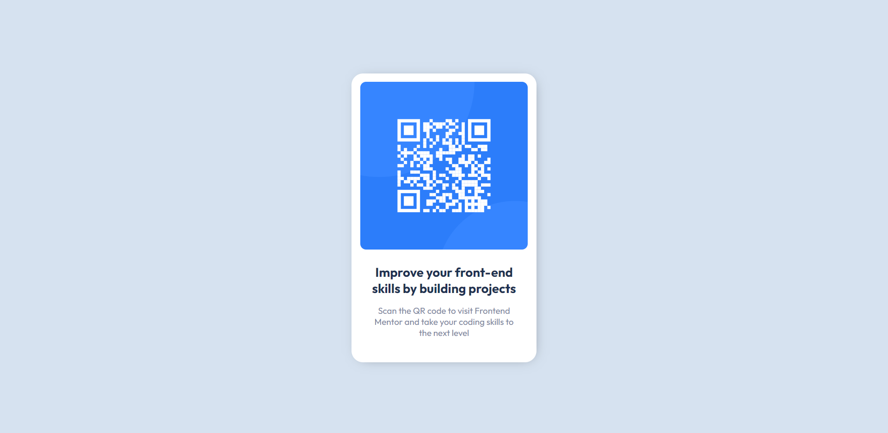

# Frontend Mentor - QR code component solution

This is a solution to the [QR code component challenge on Frontend Mentor](https://www.frontendmentor.io/challenges/qr-code-component-iux_sIO_H). Frontend Mentor challenges help you improve your coding skills by building realistic projects. 

## Table of contents

- [Overview](#overview)
  - [Screenshot](#screenshot)
  - [Links](#links)
- [My process](#my-process)
  - [Built with](#built-with)
  - [Continued development](#continued-development)
  - [Useful resources](#useful-resources)
- [Author](#author)
## Overview

### Screenshot

### Links

- [Solution URL](https://your-solution-url.com)
- [Live Site URL](https://stk-qrcode.netlify.app/)

## My process

It's been quite a while since I've touched HTML and CSS, but I decided to start learning things again. This challenge was pretty easy for me, despite not having coded for a bit, I managed to write the solution code super easily. I started off by importing all the design files to figma and then used their tools to get the right dimensions, font sizes, etc. I used a minimal CSS reset by Kevin Powell. Of course, I didn't do all this without any additional help, I used Google and even ChatGPT if I wanted to ask a question. You'll soon realize that as a developer, you never stop googling or finding help.

### Built with

- Semantic HTML5 markup
- CSS custom properties
- Flexbox

### Continued development

I hope to continue perfecting my HTML and CSS skills, later out I'm planning to branch out to JavaScript and Python.

### Useful resources

- [ChatGPT](https://chat.openai.com) - This bot is amazing! I used it when I had questions about which heading tags I should use and other semantic-related questions!

## Author

- Frontend Mentor - [@shinthantkn](https://www.frontendmentor.io/profile/shinthantkn)
- Twitter - [@shinfluencer](https://www.twitter.com/shinfluencer)

Thanks for checking out my solution!
